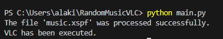
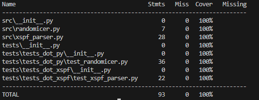
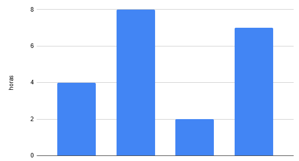
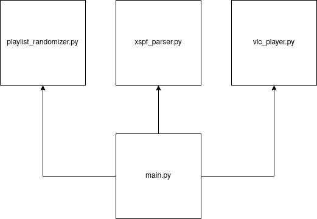

# RandomMusicVLC

## Aaron Silvoso Garcia 1ºDAM

## Descripción del Proyecto
Este proyecto, RandomMusicVLC, está diseñado para proporcionar aleatoriedad al reproducir música. Utiliza una combinación de archivos de lista de reproducción en formato xspf (el mismo que usa VLC cuando exportas una lista), el reproductor multimedia VLC, y una función de aleatorización para ofrecer variedad en la reproducción de tus pistas favoritas.

Es un proyecto de examen para https://github.com/dfleta

## Cómo instalar
### Requisitos
    python3
    VLC en el path C:\\Program Files\\VideoLAN\\VLC\\vlc.exe
    git
### Instalación en Entorno Virtual (Virtualenv)

1. Clona el proyecto:

    ```bash
    git clone https://github.com/AlakX86/RandomMusicVLC.git
    ```

2. Accede a el:

    ```bash
   cd RandomMusicVLC
    ```
    Es muy importante que aquí en la raiz pongas tu music.xspf

#### Es probable que no necesites estos 2 ultimos pasos, si unicamente quieres ejecutar el programa, ve a la sección de ejecución, esto es solo es necesario para desarrolladores

3. Instala virtualenv:

    ```bash
    pip install virtualenv
    ```
    
4. Inicializa el entorno virtual e instala las dependencias:

    ```bash
    python -m venv venv
    .\venv\Scripts\activate
    (venv) $ pip install -r requirements.txt
    ```

## Ejecución de la Aplicación

1. Ejecuta la aplicación:

    ```bash
    python main.py
    ```

## Dependencias

- `colorama==0.4.6`
- `coverage==7.3.2`
- `iniconfig==2.0.0`
- `packaging==23.2`
- `pluggy==1.3.0`
- `pytest==7.4.3`

### Verificación de Dependencias

Para verificar las dependencias instaladas y asegurarse de que no haya problemas:

```bash
$ pip check
No broken requirements found.
```
## Metodología

El desarrollo de RandomMusicVLC siguió una metodología estructurada en las ramas de develop y main, ademas de una rama release para preparar la version completamente funcional de la aplicacion

### Planteamiento de la Aplicación

La aplicación consta de tres componentes principales:
1. **Randomizer (`randomicer`)**: Esta función toma una lista de reproducción y la devuelve en un orden aleatorio. *Sé que esta mal escrito*
2. **VLC Player (`vlc_player`)**: Utiliza el reproductor multimedia VLC para reproducir una lista de ubicaciones de archivos de audio
3. **XSPF Parser (`xspf_parser`)**: Analiza un archivo en formato xspf para extraer las ubicaciones de los archivos de audio

### Arquitectura de la Aplicación

La arquitectura es modular. La ejecución comienza con el análisis del archivo xspf, seguido de la aleatorización de la lista de reproducción y finalmente la reproducción de los archivos utilizando VLC

### Esquema de Datos

Las ubicaciones de los archivos de audio se almacenan en una lista, que es procesada por los la aplicación main.py

## Pruebas

### Ejecución Correcta




## Coverage



## Tiempo invertido



La primera columna, de las 4 horas, fueron principalmente a ver posibles integraciones de código en mi proyecto, estudiar el parseo de los datos, ver que había que hacer en el proyecto. Básicamente, preparación del proyecto

La segunda columna, de 8 horas,se concentró sobre todo la parte de codigo y hacer los test

Luego se le dedicó 2 horas a la documentación(requirements.txt,readme...)

Y por ultimo, 7 horas de revisión de toda la rubrica y completar partes que no se habían cubierto(como esta), ya sean del código, o de la documentación. Basicamente 7 horas de revisión y mejora del código.

## Diagrama de componentes



## Conclusiones

### Posibles Mejoras
- Modificar la devolución de los errores, quizá mediante su propio error, en vez de con el print
- Añadir casos test para vlc_player
- No obligar al usuario a usar una lista llamada music.xspf
- Hacerlo multiplataforma
- Control de errores en randomicer
### Dificultades
- Casos test, hay casos test en randomicer que podrian considerarse postcondiciones, pero no se muy bien como hacer casos test en randomicer mas allá de 2 casos test, que es la postcondicion de longitud y el test de cuando la lista es < 2, los demas test son para la reutilizacion del codigo y por probar otras entradas, pero sin mucho sentido. En el caso de vlc_player, simplemente no encontré forma simple de hacer casos test
- Parseo de los datos
